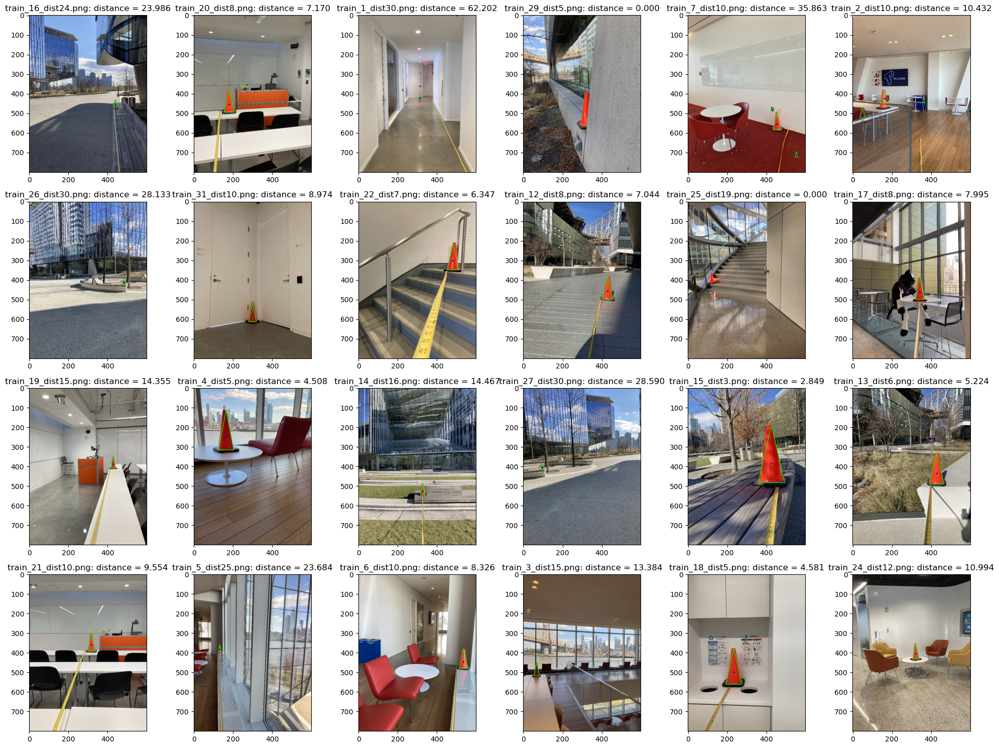

# gmm_seg_classifier
Image segmentation and classification using Gaussian Mixture Models


# Usage
Install micromamba or mamba as the package manager. To install micromamba, refer to the [installation guide](https://mamba.readthedocs.io/en/latest/installation/micromamba-installation.html)

To install the classifier:
1. Clone the repo
```
git clone https://github.com/fyng/gmm_seg_classifier.git
```
```
cd gmm_seg_classifier
```

2. Create virtual environment
```
micromamba env create -f environment.yml
```
```
micromamba activate gmm
```

3. Install the model
```
pip install .
```

4. Run the model
In `main.py`, update the directory of the test folder. Then run
```
python main.py
```

# Acknowledgement
ECE 5242 - Intelligent Autonomous Systems taught by Prof Daniel Lee & Travers Rhodes 