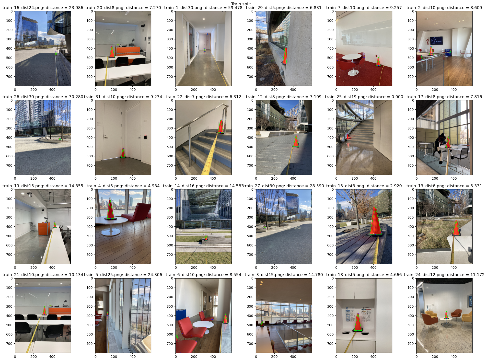

# Github
https://github.com/fyng/gmm_seg_classifier.git

# Introduction
In this project, we aim to identify objects in the scene through training a machine learning mode. The task is formulated as *semantic segmentation* -- partitioning the scene into objects by assigning a label to every pixel in an image. 

# Problem Statement
Given an array of pixels (a 2D image), segment the pixels containing orange cones.

# Approach
Here, I solve the simpler problem of classifying a given pixel into ['orange cone', 'not orange cone'], independent of spatial location and the surrounding pixel context. This is as opposed to e.g. a convolutional neural network approach, where the convolution kernel explicitly mixes information from a small neighbourhood of pixels

My pipeline consists of the following:
1. A pixel classifier: given a pixel, represented as an array of [R-value, G-value, B-value], return a probability of the pixel being an orange cone versus not. The pixel classifier returns a probability map over the image, which I then threshold to produce a binary classification mask. 
2. A cleanup pipeline: use a series of dilation and erosion operations to clean up artifacts from the binary classification mask from step 1. The triangle shape is then fitted to the remaining contours.
3. Introducing geometric constrains: further refine the contours from step 2 by removing contours that does not abide by the known height-to-base ratio of the cone. 
4. Distance estimation: using the pinhole camera model approximation, estimate the distance from the camera to the cone using the known dimensions of the cone. 


## 1.Pixel classifier
I implemented two models for pixel classification: a simple Gaussian model and a Gaussian Mixture Model (GMM). Both models utilize multidimensional Gaussians with 3 variables, for the RGB channels respectively. *I choose the RGB space since it uses all available information in the image.*. 

The orange cones are manually segmented from the images and the models are trained on the collection of all orange cone pixels. Separately a background model is trained on the background pixels. During training, the model learns to estimate P(x|y, theta), where x is the pixel in RGB, y is the label, and thera is the model's internal representation. 

During the fitting, the model parameters are used to calculate the posterior probability of P(y|x). The posterior probability is derived using the cone model for p(cone | x), the background model for p(background | x), and the prior p(cone) was empirically derived from relative abundance of cone pixels in the training set. In particular, I choose not to set p(background | x) = 1 - p(cone | x) as the multivariate Gaussian has a long tail and the normalized probability density function asssigns a small value to each point.

Running the pixel classifier on a test image returns a probability mask of the same size as the image. Each pixel is assigned a value [0,1] corresponding to its p(cone).

### Gaussian Model
The Gaussian model is parameterized by its mean and variance. To fit the model, the mean and variance can be directly taken over the training data points. During inference or fitting, the mean and variance 

### Gaussian Mixture Model
The GMM tries to fit 2 Gaussian components to the data. I choose `n_components=2` based on visual inspection of the images, which are taken indoors (lower-lighting) and outdoors (bright lighting). I believe that `n_components=2` is a good tradeoff between representation power and computation time. 

To jointly fit the 2 Gaussians, I implemented the EM-algorithm. The EM algorithm consists of two main steps that are repeated iteratively until convergence:
* Expectation Step (E-Step): Given the current estimates of the model parameters, calculate soft cluster assignment (*responsibility*) of each data point to the two components in the GMM. This is done by calculating the probability of the data for each cluster under the multivariate Gaussian, and normalizing the probabilities to 1.
* Maximization Step (M-Step): Update the model parameters (means, covariances, mixing coefficients) using the *responsibilities* computed in the E-Step. This maximizes the likelihood of the observed data point under the current estimates of the cluster memberships.

## 2.Cleanup pipeline
The probability mask from step 1 is thresholded to create a binary classification mask for cones. *The threshold is determined by visually inspecting the binary classification mask from the training dataset.* A potential future extension is to optimize the threshold empirically using a Intersection-over-Union (IoU) metric between the training dataset segmentation and the classification mask. 

The binary classification mask then undergoes a series of dilations and erosions to clean up small regions, which are likely misclassifications. The erosion uses a small square kernel to remove small regions, and the subsequent dilation restores the eroded border in the remaining large objects. 

Next, a polygon contour is fitted around each remaining region of the binary mask (*shown in blue*). A bounding box around the polygon contour is derived. This bounding box should encompass the entire cone, and enable further geometric constrains.

## 3.Geometric constraints
The height and base width of the triangle can be directly taken from the bounding box. We know that the cone should be 17 inches by 7.5 inches, and I use that ratio to further reject objects which have the same color profile, and therefore were misclassified as orange cones (e.g. orange podium, sofa). Specifically, I impose that the height / width of the bounding box must be within a tolerance threshold of the orange cone. The threshold is also determined by visually inspecting the training dataset. 

## 4.Distance estimation
The pinhole camera model describes the following equation:
$$ \frac{\text{object size}}{\text{image size}} = \frac{\text{distance to object}}{\text{focal length}}$$

We know that the cone is 17 inches in height and 7.5 inches in width, and we also have a set of segmented training images with cone height and width in pixels, as well as the known distance to the object. Therefore, the focal length can be calculated. Here, I found a **focal length of 50 pixels**. 

To calculate the distance of a cone in the test set, I calculate the distance to object as $\frac{\text{object size} \times \text{image size}}{\text{focal length}}$. The height and base width of the cone is used to estimate the distance independently, then averaged to derive the reported distance estimate. 

# Results
**Test dataset:**

```
ImageNo = [3], CentroidX = 319.000, CentroidY = 453.000, Distance = 7.622
ImageNo = [2], CentroidX = 470.000, CentroidY = 531.000, Distance = 3.737
ImageNo = [1], CentroidX = 228.000, CentroidY = 522.000, Distance = 7.583
ImageNo = [5], CentroidX = 261.000, CentroidY = 451.000, Distance = 7.336
ImageNo = [5], CentroidX = 346.000, CentroidY = 600.000, Distance = 2.825
ImageNo = [4], CentroidX = 301.000, CentroidY = 419.000, Distance = 21.378
```

---

Train split:
```
ImageNo = [16], CentroidX = 439.000, CentroidY = 470.000, Distance = 23.986
ImageNo = [20], CentroidX = 181.000, CentroidY = 493.000, Distance = 7.270
ImageNo = [1], CentroidX = 313.000, CentroidY = 431.000, Distance = 30.804
ImageNo = [1], CentroidX = 345.000, CentroidY = 253.000, Distance = 59.478
ImageNo = [29], CentroidX = 310.000, CentroidY = 566.000, Distance = 6.831
ImageNo = [7], CentroidX = 454.000, CentroidY = 585.000, Distance = 9.257
ImageNo = [2], CentroidX = 58.000, CentroidY = 521.000, Distance = 22.435
ImageNo = [2], CentroidX = 362.000, CentroidY = 446.000, Distance = 32.460
ImageNo = [2], CentroidX = 161.000, CentroidY = 471.000, Distance = 8.609
ImageNo = [26], CentroidX = 482.000, CentroidY = 424.000, Distance = 30.280
ImageNo = [31], CentroidX = 298.000, CentroidY = 613.000, Distance = 9.234
ImageNo = [22], CentroidX = 482.000, CentroidY = 348.000, Distance = 6.312
ImageNo = [12], CentroidX = 429.000, CentroidY = 498.000, Distance = 7.109
ImageNo = [17], CentroidX = 342.000, CentroidY = 511.000, Distance = 7.816
ImageNo = [19], CentroidX = 427.000, CentroidY = 410.000, Distance = 14.355
ImageNo = [4], CentroidX = 161.000, CentroidY = 314.000, Distance = 4.934
ImageNo = [14], CentroidX = 327.000, CentroidY = 547.000, Distance = 14.583
ImageNo = [27], CentroidX = 97.000, CentroidY = 417.000, Distance = 28.590
ImageNo = [15], CentroidX = 423.000, CentroidY = 483.000, Distance = 2.920
ImageNo = [13], CentroidX = 426.000, CentroidY = 490.000, Distance = 5.331
ImageNo = [21], CentroidX = 315.000, CentroidY = 393.000, Distance = 10.134
ImageNo = [5], CentroidX = 132.000, CentroidY = 397.000, Distance = 24.306
ImageNo = [6], CentroidX = 15.000, CentroidY = 683.000, Distance = 11.250
ImageNo = [6], CentroidX = 534.000, CentroidY = 481.000, Distance = 8.554
ImageNo = [3], CentroidX = 68.000, CentroidY = 516.000, Distance = 14.780
ImageNo = [18], CentroidX = 234.000, CentroidY = 562.000, Distance = 4.666
ImageNo = [24], CentroidX = 323.000, CentroidY = 434.000, Distance = 11.172
```


Validation split:
```
ImageNo = [18], CentroidX = 234.000, CentroidY = 562.000, Distance = 4.666
ImageNo = [7], CentroidX = 454.000, CentroidY = 585.000, Distance = 9.257
ImageNo = [15], CentroidX = 423.000, CentroidY = 483.000, Distance = 2.920
ImageNo = [26], CentroidX = 482.000, CentroidY = 424.000, Distance = 30.280
```


